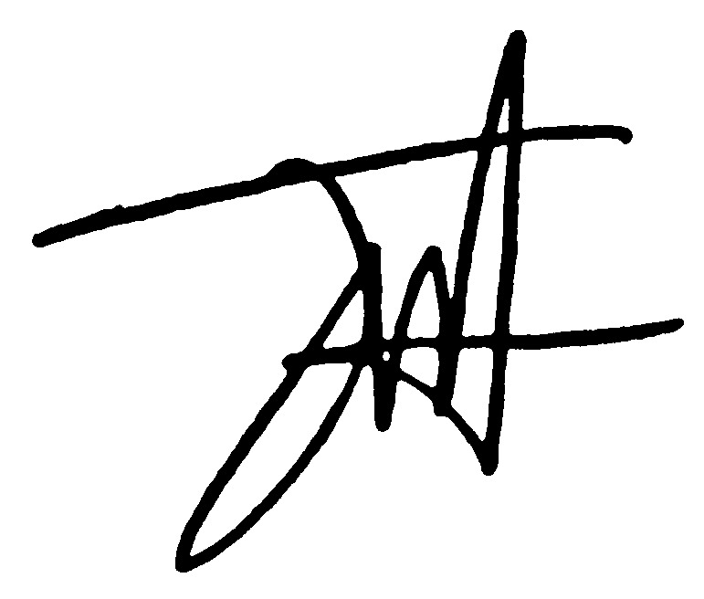

# D7 — Batas lingkup capstone (ditandatangani di Sesi 8)

> Diisi tim **sebelum** menghadap dosen. Dosen hanya mencoret dan tanda tangan.
> Form ini yang jadi acuan rubrik di Sesi 15–16: yang kamu potong tidak dihitung sebagai kekurangan.

Tim: Kelompok 6 | Topik / slice: ____________________ | Tanggal: __________

## AKAN DIBANGUN (maksimal 1 fact table + 1 conformed dimension per RPS butir 8)

| # | Artefak | Ukuran selesai | Deadline |
|---|---|---|---|
| 1 | fact: ____________________ |  |  |
| 2 | conformed dim: ____________________ |  |  |
| 3 | metrik di kamus: _______ dari 3 |  |  |
| 4 | dashboard: _______ tile |  |  |

## TIDAK LAGI DIBANGUN (sebut namanya, jangan "kalau ada waktu")

| # | Yang dicabut | Alasan |
|---|---|---|
| 1 |  |  |
| 2 |  |  |

## Tanda tangan

| Tim | Dosen |
|---|---|
|  |  |
|  | [tanda tangan] |
