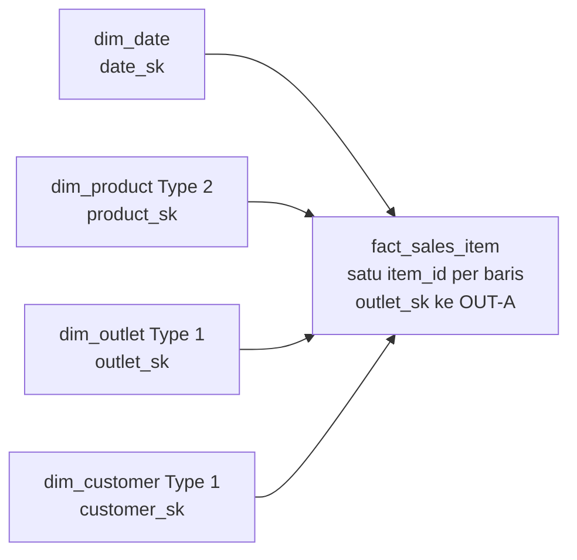

# Brief desain UTS — Kelompok 6 / T2 POS UMKM / slice k9

**Status:** jumlah dimensi dan pemotongan scope sudah dikonfirmasi dosen; target jumlah metrik/tile dan deadline D7 telah disepakati kelompok pada 29 September 2026. **Batas:** Outlet A (`OUT-A`) dan transaksi tanggal lokal WIB 1 Januari–30 Juni 2025. Folder `data/raw/t2_umkm/` adalah dataset yang diberikan. Scope −20% tidak menghapus tujuh deliverable UTS.

## Tujuan dan keputusan

Pengguna yang diusulkan ialah **Manajer Outlet A**. Keputusan yang didukung adalah bulan mana perlu ditinjau karena perubahan nilai penjualan item PAID, produk mana memberi kontribusi terbesar, dan kapan proporsi transaksi berstatus REFUND naik. Hasilnya membantu prioritas pemeriksaan operasional; data ini tidak cukup untuk menyatakan laba atau nilai refund bersih.

Pertanyaan bisnis:

1. Berapa nilai item PAID valid dan jumlah transaksi PAID per bulan Januari–Juni 2025?
2. Produk apa yang kontribusi nilai item PAID validnya tertinggi setiap bulan?
3. Berapa jumlah dan rasio transaksi berstatus REFUND per bulan?

Jawaban yang diharapkan dari profiling sumber dengan kebijakan kualitas dalam desain:

| Query | Kolom keluaran | Satu kalimat jawaban yang diharapkan |
|---|---|---|
| `q01_tren_bulanan.sql` | bulan, nilai_paid_rp, transaksi_paid | Mei 2025 tertinggi dengan nilai item PAID valid Rp33.051.000 dari 413 transaksi. |
| `q02.sql` | bulan, product_id, nama_produk_tercatat, nilai_paid_rp, peringkat | PRD-0003 berada di peringkat pertama pada Februari, Mei, dan Juni 2025. |
| `q03.sql` | bulan, transaksi_refund, transaksi_tercatat, rasio_refund_persen | Juni 2025 mencatat 8 transaksi REFUND dari 420 transaksi pada fact, sekitar 1,90%. |

Angka di atas berasal dari `docs/profile_t2_k9_slice.md`, dihitung baca-saja pada CSV setelah aturan deduplikasi/karantina yang dirancang. **Query warehouse belum dijalankan.** Setelah implementasi diperbolehkan, hasil fact harus direkonsiliasi dengan angka ini dan pengecualian sumber.

## Sumber dan batas data

| Sumber | Key dan peran | Pemakaian |
|---|---|---|
| `transactions.csv` | `transaction_id`; `outlet_id`, `customer_id`, `tanggal_waktu`, `status`, `total_bayar` | Menetapkan outlet, waktu WIB, status, dan degenerate key. |
| `transaction_items.csv` | `item_id`, `transaction_id`, `product_id` | Grain dan nilai item: qty, harga transaksi, diskon. |
| `products.csv` | `product_id` | Nama/kategori dan referensi produk; harga master tidak menggantikan harga item. |
| `outlets.csv` | `outlet_id` | Memastikan `OUT-A` valid dan unik pada master; sumber `dim_outlet` Type 1. |
| `customers.csv` | `customer_id` | Atribut pelanggan; ID kosong menjadi pembeli anonim. |

Satu folder sumber T2 berisi semua outlet/periode. Profiling bawaan `pipeline.profile --topic t2 --slice k9` masih menghitung seluruh CSV; test dan angka desain memakai query tambahan yang benar-benar memfilter slice. String waktu bertanda `Z` diperlakukan UTC lalu dikonversi ke WIB. String tanpa zona diasumsikan WIB. Data yang tidak dapat diparse tidak dimasukkan secara spekulatif ke periode.

Temuan slice: 2.578 baris header untuk 2.543 ID transaksi, 5.074 baris item terkait untuk 5.032 ID item, 34 kelompok header duplikat, empat ID header konflik, 42 kelompok item duplikat identik, 92 item qty negatif PAID (ditambah 2 pada VOID), dan 21 header tanpa item. Enam angka test yang tepat serta SQL buktinya berada di `docs/profile_t2_k9_slice.md`.

## Grain dan star schema

**Grain fact:** tepat satu baris per `item_id` pada transaksi valid Outlet A dalam periode enam bulan, setelah item identik dide-duplikasi dan header konflik/PAID bermasalah dikarantina. `transaction_id` tetap di fact sebagai **degenerate dimension**; produk yang sama pada dua item transaksi tetap dua baris. Header konflik tidak dipilih acak. `total_bayar` header tidak diulang di fact karena akan menggandakan angka.

DDL: `sql/10_dim_date.sql` (diberikan), `sql/20_dim_product.sql`, `sql/20_dim_outlet.sql`, `sql/20_dim_customer.sql`, dan `sql/30_fact_sales_item.sql`. Fact menyimpan empat FK dimensi, `item_id`, `transaction_id`, `outlet_sk` hasil lookup `OUT-A` dari header tervalidasi, waktu WIB, status, qty, harga item, diskon item, `qty_paid`, dan `nilai_paid_rp`.

**Koreksi terbaru dosen:** tiga tabel dimensi domain **ditambah** `dim_date`, sehingga total ada empat: `dim_date`, `dim_product`, `dim_outlet`, dan `dim_customer`. `dim_outlet` aktif walaupun slice hanya `OUT-A`; fact menyimpan `outlet_sk`. Tiga file `20_dim_*.sql` kini sesuai struktur checker. Koreksi lisan dosen sudah dicatat kelompok; keputusan aktif dan konsekuensi desainnya diringkas di paragraf ini.

### SCD dan aditivitas

`dim_product` adalah **SCD Type 2** dengan `product_sk` stabil per versi, `valid_from`, `valid_to`, `is_current`, dan lookup `[valid_from, valid_to)`. Snapshot master tunggal tidak membuktikan harga/kategori masa lalu. Versi awal memakai tanggal sentinel “as known from snapshot” untuk lookup dan perubahan berikutnya disimpan sebagai versi baru ketika benar-benar teramati. Nilai faktual transaksi tetap dari harga item. `dim_customer` dan `dim_outlet` Type 1 karena koreksi atribut pelanggan/outlet pada scope ini tidak membutuhkan histori analitik; pelanggan kosong memakai anggota ANONIM.

| Measure fact | Aditivitas | Aturan |
|---|---|---|
| `nilai_paid_rp` | Additive | SUM aman lintas tanggal, produk, outlet, dan pelanggan setelah satu item valid hanya satu baris; outlet slice tetap `OUT-A`; REFUND/VOID bernilai 0. |
| `qty_paid` | Additive secara aritmetika | SUM boleh untuk jumlah unit PAID; perbandingan lintas produk berbeda memerlukan kehati-hatian makna unit. |
| `qty_item` | Non-additive tanpa filter | REFUND memiliki tanda qty campuran; SUM semua status tidak berarti penjualan bersih. |
| `harga_satuan_rp` | Non-additive | Harga per unit; gunakan agregasi berbobot bila mencari harga rata-rata, jangan SUM. |
| `diskon_item_rp` | Non-additive lintas status | Diskon sumber disimpan untuk audit; untuk total diskon PAID, filter status dan validitas terlebih dahulu. |
| Jumlah transaksi (turunan query) | Non-additive antar-grup item | Hitung `COUNT(DISTINCT transaction_id)`, bukan `COUNT(*)` fact. |
| Rasio refund (turunan query) | Non-additive | Hitung ulang pembilang/penyebut per potongan, jangan SUM rasio. |

**Asumsi finansial:** `diskon` ditafsirkan nominal rupiah per baris item, sehingga `nilai_paid_rp = qty * harga_satuan - diskon` pada PAID valid. Nilai yang ditemukan 0/1.000/2.000/5.000 mendukung asumsi, tetapi metadata satuan tidak tersedia; pemilik data harus mengonfirmasi sebelum pemakaian resmi. Status REFUND tidak dipakai untuk mengurangi metrik ini karena qty dan tautan ke transaksi asal tidak konsisten/tersedia. Ini **nilai item PAID tercatat**, bukan laba atau net setelah refund.

## Alur load, test, dan metrik

`pipeline/DESIGN_load.md` menetapkan full replace staging setiap run, filter transaksi k9, deduplikasi identik, karantina konflik dan anomali PAID, MERGE dimensi, lalu MERGE `fact_sales_item` by `item_id` dengan pembersihan baris target k9 yang tidak lagi valid. Natural key, window, risiko penggandaan, penanganan SCD, dan idempotensi ditulis per tabel. Tidak ada loader yang dijalankan pada UTS.

Enam test `topic: t2` dalam `tests/test_definitions.yml` memeriksa duplikat header (34), konflik header (4), duplikat item (42), qty negatif PAID (92), header tanpa item (21), dan orphan produk pada item slice (0). Lima test diperkirakan `fail` pada sumber, satu `pass`; setiap angka dan query di `docs/profile_t2_k9_slice.md`. Test runner tidak dijalankan.

Satu metrik UTS adalah **nilai item PAID valid Outlet A**. Dua belas field, SQL `sql/50_metrics/nilai_item_paid.sql`, cara gaming diskon diubah menjadi nol, dan guard perbandingan diskon/nilai terhadap staging ada di `docs/kamus_metrik.md`.

## Keputusan, alternatif, dan keterbatasan

| Keputusan | Bukti/alasan | Alternatif yang ditolak dan akibatnya |
|---|---|---|
| Gunakan `item_id` sebagai grain | ID item tersedia; 42 duplikat pada slice identik setelah diperiksa. | `(transaction_id, product_id)` dapat menggabungkan item produk yang sama dalam satu transaksi. |
| Batasi k9 setelah konversi WIB | Penugasan Outlet A/enam bulan; 375 header slice bertanda `Z`. | Filter string mentah/UTC dapat memindah transaksi dekat batas hari/periode. |
| Karantina empat ID header konflik | Satu ID memiliki dua payload berbeda. | Memilih nilai pertama/terakhir tanpa aturan akan mengubah tanggal, pelanggan, atau nilai. |
| Nilai item PAID valid sebagai metrik | REFUND memuat qty positif dan negatif tanpa link asal. | Mengurangkan seluruh REFUND sebagai angka bersih akan mengklaim refund yang belum terukur. |
| Produk Type 2 dengan seed “as known” | Hanya satu snapshot master, sementara 110 dari 120 tanggal harga mulai setelah 1 Januari 2025. | Memakai harga master saat ini sebagai harga historis akan mengubah nilai transaksi lampau. |
| Gunakan tiga dimensi domain dan kalender | Koreksi dosen menegaskan tiga domain + `dim_date`; master outlet tersedia dan `OUT-A` perlu divalidasi. | Menyimpan outlet hanya sebagai atribut fact menghilangkan FK outlet dan tidak mengikuti jumlah dimensi terbaru. |
| Full scan enam bulan setiap run | Sumber tidak punya `updated_at` yang andal. | Watermark hanya bulan terbaru dapat melewatkan koreksi lama. |

**Pertanyaan yang belum dapat dijawab:** Produk mana yang menghasilkan *laba bersih* terbesar di Outlet A? CSV menyediakan qty, harga jual, diskon, dan pembayaran header, tetapi tidak menyediakan HPP historis maupun biaya operasional/alokasinya. Untuk menjawab diperlukan data biaya/HPP menurut periode, aturan alokasi biaya, dan definisi laba. Data tambahan tersebut hanya dicatat sebagai kebutuhan masa depan; UTS tidak memakai dataset lain.

## D7 dan batas pekerjaan

`docs/D7_scope_cut.md` merinci apa yang akan dibangun menuju UAS dan apa yang dicabut: Outlet B/C, perbandingan antar-outlet, serta periode di luar Januari–Juni 2025. Dosen mengonfirmasi pembatasan Outlet A/enam bulan sudah memenuhi scope −20%. Kelompok menyepakati target 2 dari 3 metrik dan 3 tile dengan deadline bersama 30 September 2026; definisi metrik kedua dirinci saat pembangunan. D7 cukup diisi dan dibaca dosen; tidak memerlukan tanda tangan atau salinan dalam PDF pengumpulan.

Paket desain UTS meliputi brief ini, DDL, desain load, YAML test dan bukti profiling, tiga query, kamus metrik, batas desain, serta D7 terisi sebagai berkas repo terpisah. PDF hanya memuat enam deliverable desain pertama; D7 dibaca dari `docs/D7_scope_cut.md` sesuai jawaban dosen. Dosen menilai repo dengan commit/tag `UTS`. `sandbox/` diabaikan Git sehingga ringkasan penugasan dan keputusan penting harus tinggal di berkas `docs/` yang dilacak.
