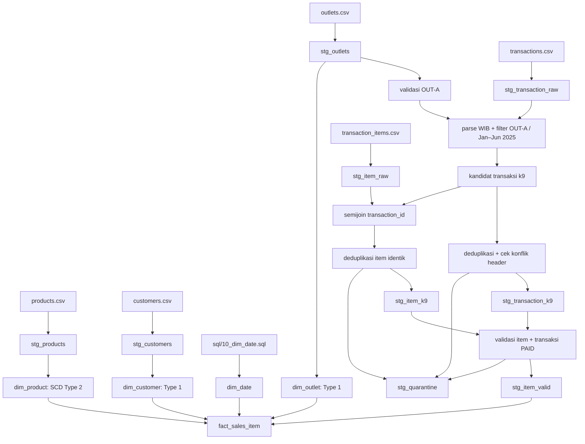

# Desain load — T2 POS UMKM, Kelompok 6 / slice k9

Dokumen ini adalah kontrak untuk implementasi sesudah UTS. Tidak ada loader atau warehouse yang dijalankan pada UTS. Sumber hanya lima CSV pada `data/raw/t2_umkm/`; batas fact adalah `OUT-A` dan tanggal transaksi lokal WIB `[2025-01-01, 2025-07-01)`.

## Alur sumber → staging → dimensi → fact



**Pemetaan waktu.** `transactions.csv` memakai `tanggal_waktu`, bukan `waktu`. Jika string berakhir `Z`, parse sebagai UTC lalu konversi ke `Asia/Jakarta`; selain itu parse sebagai waktu lokal WIB. Simpan string mentah dan `waktu_wib`. Nilai gagal parse masuk karantina waktu/cakupan, tidak otomatis masuk atau keluar slice. Filter tanggal dilakukan sesudah konversi. Outlet A berada di Bandung menurut `outlets.csv`; asumsi WIB untuk string tanpa zona dicatat karena CSV tidak menyediakan kolom zona eksplisit.

**Pemetaan item.** Item tidak memiliki outlet/tanggal sendiri. Pilih melalui `EXISTS` ke ID header yang masuk k9, sehingga header duplikat tidak menggandakan item. Item tanpa header tidak dapat dipastikan masuk slice dan dicatat sebagai cakupan tidak diketahui. Jika ID header yang sama ditemukan dengan dua nilai outlet/tanggal/status/total, karantina seluruh ID beserta itemnya sampai sumber dikoreksi; jangan pilih baris secara acak.

## Strategi tepat satu per tabel

| Tabel | Sumber dan natural key | Strategi terpilih | Partisi/window | Kapan baris dapat tergandakan |
|---|---|---|---|---|
| `stg_outlets` | `outlets.csv`, `outlet_id` | Full replace baca CSV, validasi satu baris master untuk `OUT-A`; sumber `dim_outlet` | Tidak berlaku; master kecil | Duplikat `OUT-A` atau ID tanpa master diblokir agar lookup `outlet_sk` fact tidak ambigu. |
| `stg_products` | `products.csv`, `product_id` | Full replace baca CSV, tipe VARCHAR awal | Tidak berlaku; snapshot master | Produk kembar membuat lookup fact berlipat bila key tidak divalidasi. |
| `stg_customers` | `customers.csv`, `customer_id` | Full replace baca CSV, tipe VARCHAR awal | Tidak berlaku | Pelanggan kembar dapat menggandakan setiap item terkait. |
| `stg_transaction_raw` | `transactions.csv`, `transaction_id` | Full replace baca CSV dan parse waktu | Tidak berlaku pada pembacaan | Memuat 34 kelompok ID duplikat pada slice; JOIN polos menggandakan item. |
| `stg_transaction_k9` | raw header, `transaction_id` | Full replace per run: filter, dedup identik, karantina konflik | Outlet A; tanggal WIB `[2025-01-01, 2025-07-01)` | Jika konflik 4 ID dipilih sembarang, hasil tidak stabil; constraint satu header per ID wajib. |
| `stg_item_raw` | `transaction_items.csv`, `item_id` | Full replace baca CSV | Tidak berlaku | Sumber memuat 42 kelompok item_id duplikat pada slice. |
| `stg_item_k9` | item dengan header k9, `item_id` | Full replace per run, semijoin header, dedup identik | Himpunan ID transaksi slice, bukan tanggal item | JOIN header mentah atau append item mentah menggandakan baris. |
| `stg_item_valid` | item/header kanonik, `item_id` | Full replace setelah validasi dan karantina | K9 sama seperti header | Jika satu item cocok ke lebih dari satu versi produk, hasil fact berlipat. |
| `stg_quarantine` | pelanggaran header/item | Full replace dengan reason code dan key sumber | Satu snapshot input | Append tanpa key `(source_file, source_key, reason)` menggandakan catatan masalah. |
| `dim_date` | generator `sql/10_dim_date.sql`, `date_sk` | Full replace sesuai SQL dosen | 2024–2027 + Unknown `-1` | Generator deterministik tidak mengganda; cek key unik setelah dibuat. |
| `dim_outlet` | master outlet, `outlet_id` | MERGE Type 1: update atribut, insert ID baru | Tidak berlaku | INSERT tiap run membuat outlet ganda; lookup fact wajib tepat satu SK untuk `OUT-A`. |
| `dim_customer` | master pelanggan, `customer_id` | MERGE Type 1: update atribut, insert ID baru | Tidak berlaku | INSERT tiap run membuat pelanggan ganda; customer kosong memakai anggota ANONIM `-2`. |
| `dim_product` | master produk, `product_id` + `valid_from` untuk versi | MERGE SCD Type 2 sesuai perubahan atribut terlacak | Window versi `[valid_from, valid_to)`; bukan watermark transaksi | Menambah versi setiap run tanpa perubahan atau interval tumpang tindih menggandakan lookup. |
| `fact_sales_item` | item valid, `item_id`; `outlet_id` header kanonik untuk lookup `outlet_sk` | MERGE by `item_id`, lalu hapus target k9 yang tak ada pada sumber valid dalam transaksi atomik | `outlet_id=OUT-A` + tanggal WIB `[2025-01-01, 2025-07-01)` | INSERT tiap run, JOIN header mentah, atau lookup dua versi produk menggandakan nilai; FK outlet dan filter k9 menjaga cakupan outlet. |

## Kontrak validasi dan deduplikasi

1. Semua sumber dibaca sebagai teks sebelum cast. Trim status ke uppercase; domain teramati `PAID`, `VOID`, `REFUND`. Nilai lain dikarantina sampai pemilik data menetapkan makna. `item_id` dan `transaction_id` kosong, gagal cast qty/harga/diskon, harga <= 0, diskon < 0, dan tanggal tak terparse adalah blocking untuk baris terkait.
2. Satu header kanonik per `transaction_id`. Duplikat identik dibuang deterministik; empat ID konflik pada k9 masuk `stg_quarantine` beserta semua itemnya. Satu item kanonik per `item_id`; 42 kelompok duplikat item yang identik boleh dikurangi menjadi satu. Jika `item_id` sama dengan payload berbeda, karantina seluruh ID.
3. Qty negatif pada header `PAID` adalah blocking. Karantina **seluruh transaksi PAID** yang terkena agar angka item yang tersisa tidak memberi total parsial yang menyesatkan. Profil sumber menunjukkan 92 baris item negatif PAID pada 90 transaksi, sedangkan 2 baris negatif VOID dicatat sebagai warning karena VOID bernilai_paid_rp=0. `VOID` dan `REFUND` tetap disimpan untuk hitungan status, dengan `nilai_paid_rp = 0`.
4. Item dengan `product_id` nonkosong yang tidak ada di master adalah blocking/karantina, tidak disamarkan menjadi produk Unknown untuk nilai penjualan. `customer_id` kosong berarti ANONIM `customer_sk=-2`; customer ID nonkosong yang tidak cocok memakai Unknown `-1` disertai warning dan daftar audit. Outlet selain A tidak masuk slice; `OUT-A` harus tepat satu pada master; `outlet_sk` fact di-lookup dari `dim_outlet` memakai `outlet_id` header kanonik.
5. Asumsi kerja `diskon` adalah **nominal rupiah per baris item**, didukung nilai 0/1.000/2.000/5.000 dan tidak ada nilai yang melebihi subtotal positif pada slice. Sumber tidak mendokumentasikan satuannya; konfirmasi diperlukan sebelum menyebut angka penjualan sebagai nilai finansial resmi. Untuk baris PAID valid, `nilai_paid_rp = qty × harga_satuan − diskon`, `qty_paid = qty`. Tolak subtotal negatif. Untuk REFUND/VOID, `nilai_paid_rp=0` dan `qty_paid=0`; simpan qty/harga/diskon mentah untuk audit status.
6. `total_bayar` header **tidak** disalin ke fact item. Profil menunjukkan selisih terhadap jumlah item pada banyak transaksi; rekonsiliasi sumber-vs-fact adalah warning investigasi, bukan aturan menimpa harga item. Hitung transaksi dari `COUNT(DISTINCT transaction_id)` pada fact valid.

## SCD produk dan lookup

Snapshot `products.csv` berisi satu baris per product_id. `harga_berlaku_dari` pada sebagian besar produk berada setelah awal 2025, sehingga bukan bukti semua versi harga historis. Untuk seed awal, simpan **atribut yang diketahui dari snapshot** sebagai satu versi per produk dengan `valid_from=1900-01-01`, `valid_to=9999-12-31`, `is_current=true`. Tanggal sentinel hanya memungkinkan lookup historis yang konsisten; nama/kategori masa lalu tetap berlabel *as known from current snapshot*. Nilai penjualan memakai harga **item**, sehingga tidak mengasumsikan harga referensi master saat transaksi.

Ketika snapshot produk berikutnya tersedia, bandingkan hash atribut terlacak (`nama_produk`, `kategori`, `harga_satuan` referensi, `aktif`). Jika tidak berubah, jangan buat versi. Jika berubah, tutup versi aktif pada tanggal perubahan yang **teramati**, buat SK baru dengan `valid_from` sama dengan batas penutupan, dan pastikan tepat satu `is_current=true` per product_id. Perubahan yang diketahui terlambat memerlukan aturan restatement fact berdasarkan tanggal efektif yang benar-benar diketahui; jangan membuat histori masa lalu dari tebakan. `product_sk` dialokasikan dari sequence, bukan dihitung ulang dengan `row_number()` pada setiap load. `customer_sk` dan `outlet_sk` stabil saat Type 1 menimpa atribut; outlet tetap punya surrogate key meskipun slice hanya `OUT-A`.

Lookup fact ke `dim_product` memakai product_id serta `tanggal_wib >= valid_from AND tanggal_wib < valid_to`; wajib menghasilkan tepat satu SK. `dim_customer` dan `dim_outlet` lookup dari key bisnis; fact menyimpan `date_sk`, `product_sk`, `outlet_sk`, dan `customer_sk`. Cakupan `OUT-A` dijaga dari header kanonik dan FK outlet. `dim_date.date_sk` dari tanggal WIB; cek key kalender unik walaupun generator bawaan memakai CTAS tanpa deklarasi PK.

## Upsert, perubahan, dan idempotensi

Natural key fact adalah `item_id`, setelah profil memastikan 42 duplikatnya identik. MERGE mengubah nilai dan FK bila item/header yang sama dikoreksi; INSERT hanya untuk item_id baru. Setelah MERGE, hapus item target **dalam slice k9** yang tidak lagi ada pada `stg_item_valid` karena pembatalan, perubahan tanggal/outlet, atau karantina. Operasi dilakukan atomik agar pembaca tidak melihat snapshot setengah jadi. Jangan menghapus record di luar k9.

Partisi logis adalah bulan transaksi WIB, tetapi **tidak ada `updated_at`** pada sumber yang menjamin koreksi lama tertangkap oleh watermark. Oleh karena itu setiap run membaca ulang seluruh enam bulan k9 sebelum MERGE; window tidak dipersempit hanya ke bulan terbaru. Setelah input yang sama diproses dua kali, jumlah `item_id`, total `nilai_paid_rp`, dan jumlah versi produk harus tetap sama. Cek ini adalah kriteria desain untuk implementasi nanti, bukan klaim hasil UTS.

## Urutan dependency dan rekonsiliasi

1. Baca snapshot lima CSV ke staging dan catat jumlah/hash sumber.
2. Normalisasi waktu/status/tipe; tetapkan transaksi k9; pisahkan duplikat identik, konflik, dan baris tak terparse.
3. Bentuk item k9 lewat semijoin, dedup, validasi produk/qty/diskon, dan karantina transaksi PAID bermasalah.
4. Siapkan `dim_date`, lalu MERGE `dim_outlet` (Type 1), `dim_customer` (Type 1), dan `dim_product` (Type 2); validasi `OUT-A` pada master sebelum lookup fact.
5. Lookup tepat satu SK per dimensi dan MERGE/hapus terbatas pada `fact_sales_item` k9.
6. Bandingkan jumlah item valid terhadap fact, hitung ID unik/duplikat, pastikan tidak ada SK NULL atau versi produk ganda, lalu catat selisih `total_bayar` header sebagai warning untuk diteliti.

Dimensi harus siap sebelum fact agar setiap FK dapat diisi. Baris Unknown/ANONIM harus dibuat sekali saja dan tidak berubah saat rerun. Saat penyerahan UTS, semua kontrol ini berupa desain; implementasi setelah UTS dicatat berikut ini.

## Catatan implementasi setelah UTS — 2 Oktober 2026

Atas permintaan kelompok, `sql/load.sql` kini mengimplementasikan desain untuk **t2/k9**. Staging diganti per snapshot; dimensi domain mempertahankan surrogate key dari sequence, produk menyimpan versi Type 2, dan fact memakai MERGE serta penghapusan terbatas pada k9. Seluruh load dibungkus transaksi dengan rollback saat gagal. PK/FK/CHECK mengikuti DDL dimensi domain dan fact; key kalender divalidasi secara logis karena generator `dim_date` memakai CTAS.

Perubahan atribut produk memakai tanggal pengamatan snapshot. Karena batas versi bertipe DATE, perubahan kedua pada produk yang sama dalam hari yang sama ditolak agar tidak membentuk interval kosong atau menimpa histori. Jika kasus tersebut diperlukan, sepakati resolusi waktu dan migrasi skema terlebih dahulu. Tanggal awal sentinel tetap hanya menyatakan atribut yang diketahui dari snapshot, bukan bukti histori sumber.

Database legacy tanpa PK dari loader full replace ditolak. Arsipkan database tersebut sebelum rebuild dari CSV; jangan memakai rebuild untuk database yang sudah menyimpan histori nyata. Arsip lokal hasil loader lama berada di `sandbox/knowledge_kelompok6/load_archive/` dan tidak untuk GitHub. PDF penyerahan UTS tetap menjadi snapshot desain yang telah disetujui.

Verifikasi implementasi:

```bash
.venv/bin/python -m unittest discover -s tests -p test_load_regression.py
.venv/bin/python -m pipeline.load --topic t2 --slice k9 --twice
```

Regresi menggunakan salinan CSV dalam folder sementara dan database di memori. Pengujian mencakup kesamaan seluruh isi dimensi/fact pada rerun, SK stabil, histori dan lookup tanggal produk, Type 1, karantina item/transaksi, konflik header, koreksi/hapus fact terbatas pada k9, dan rollback. `--twice` sendiri hanya memeriksa jumlah baris, sehingga tidak cukup untuk membuktikan semua aspek idempotensi.
